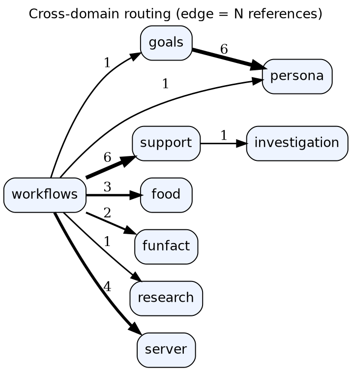
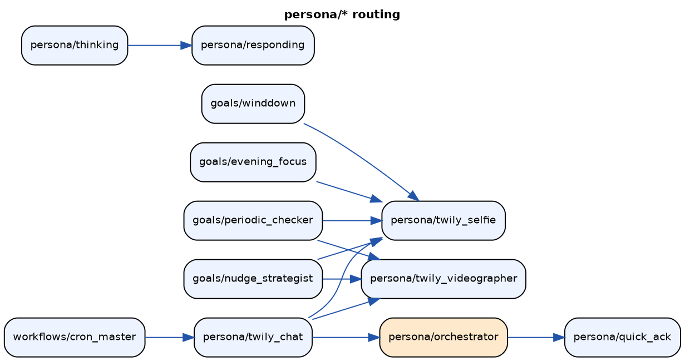
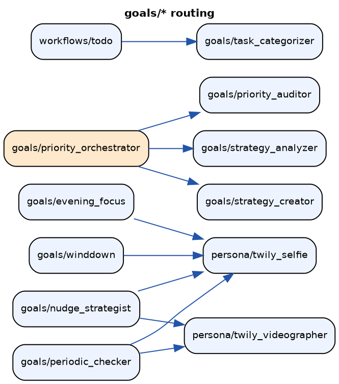
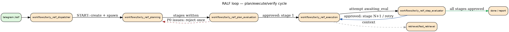
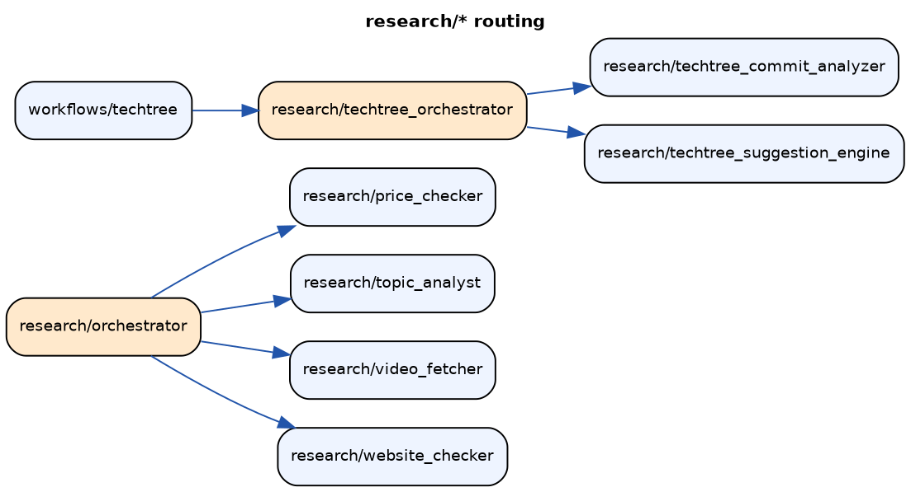
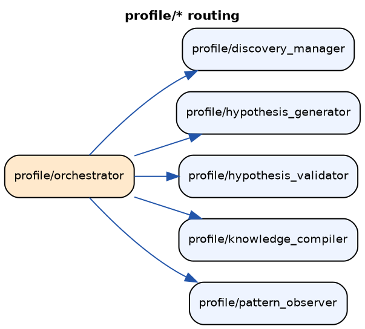
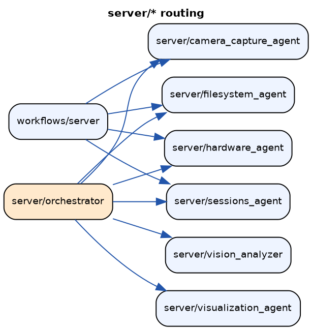
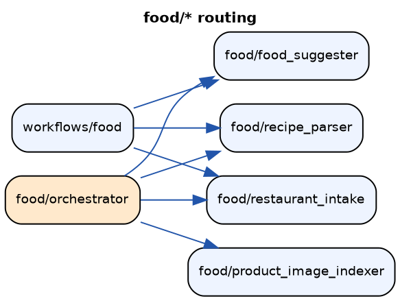

\newpage

# Executive summary

fren_infrastructure_control_v4 is a clean-room rebuild of the v3 personal
assistant ("Twily") on top of the **OpenCodeCompilerV2** agent framework. The
system runs **147 agents across 15 domains**, entirely on private
infrastructure: agents execute on a local Qwen3.5-27B (vLLM, this machine,
4xGPU tensor-parallel), while GLM-5.1 — reached exclusively through opencode —
acts as teacher (prompt rewriter) and judge.

The defining property of v4 is that **every capability is autoloop-optimizable**:
each agent, branch, and runtime policy carries machine-gradable probes, so the
system can be re-tuned automatically against any model. This report documents
what is supported, how each piece is tested, every improvement loop and its
structure, and the measured results of the first full judged fleet sweep
(15.5 hours, 157 units, zero infrastructure failures).

Key measured results:

* **Unit tests**: 1,283 framework + 496 v4 tests passing.
* **Fleet sweep**: 157 units (140 agents + 17 branch tests), 0 failed units,
  **5 promotions** (best candidate beat baseline above threshold 0.75).
* **Authored test suites**: mean score 0.83 (78% of tests >= 0.7).
* **Judged corpus probes**: mean ~ 0.3; 46% of agents floor at zero on at
  least one probe — the honest improvement backlog, enumerated per-test.
* **Retrieval ground truth**: canary facts planted in a seeded 20,101-message
  corpus are retrieved as the top semantic hit (similarity 0.69 over 20k
  messages); canary transcript is the top chunk hit.

# System architecture

```
telegram user --> bot (python-telegram-bot, async)
                   |  slash commands --> workflows/* agents
                   |  free text ------> persona/orchestrator --> subagents
                   v
            opencode runtime (sessions, tool permissions)
                   |   agents = compiled .md (prompt + scoped bash allowlist)
                   v
   local vLLM  Qwen3.5-27B-AWQ (4xGPU TP, temp 1.0/topP 0.95/topK 20)
   GLM-5.1 via opencode  (teacher + judge ONLY — never raw API)
                   |
                   v
            PostgreSQL (pgvector) — 30+ tables
            scheduler (41 crons) - checker - web dashboard (HTMX)
```

Two repositories:

* **OpenCodeCompilerV2** (the framework, → PyPI `open-agent-compiler`):
  agent/tool/test models (Pydantic), compiler (agents → opencode artifacts),
  improvement loops, evaluators, judges, workflow DAG executor, in-process
  interactive runner.
* **fren_infrastructure_control_v4** (the consumer): agent definitions, tools
  (70+ script tools), telegram/scheduler/web services, probe suites, corpus
  seeders.

The split-profile mechanism promotes per-`model_class` (default / fast /
analytical / vision), so switching local models re-tunes prompts without
touching code — the property the autoloops guarantee.

# The agent fleet

147 agents in 15 domains. Orchestrators (orange in the graphs) route to
specialist subagents; every tool-carrying agent has a per-script bash
allowlist (deny-all default, e.g. exactly `python scripts/food_manager.py*`).

| domain | agents | what it does (examples) |
|---|---|---|
| workflows | 37 | slash-command entry points: /brief, /goal, /council, RALF loop (5 agents), techtree, shopping, meal_plan, memory |
| support | 26 | daily_briefer, document_analyst, stt/tts, email/calendar, image analysis, night_analyst, master_investigator |
| goals | 18 | priority_orchestrator (morning/evening), task_triage, nudge_strategist, periodic_checker, winddown, strategy loop |
| persona | 14 | orchestrator → quick_ack / responding / thinking; topic_synthesizer, thought_forger, twily_selfie/videographer |
| research | 8 | orchestrator → video_fetcher (YT transcripts), website_checker, topic_analyst (prism analysis), price_checker |
| profile | 7 | self-examination loop: pattern_observer → hypothesis_generator → validator → discovery_manager → knowledge_compiler |
| server | 7 | hardware_agent, filesystem_agent, sessions_agent, vision_analyzer, camera_capture_agent |
| food | 6 | orchestrator, recipe_parser, restaurant_intake, meal_planner, product_image_indexer |
| rp | 6 | game_master, narrator, character_speaker, adventure_generator, world_editor/updater |
| vis_simulation | 5 | scenario_generator → conversation_simulator → quality_scorer loop |
| funfact | 4 | data_gatherer → pattern_analyst → fact_writer |
| workflow_master | 4 | agent_visualizer, documentation_generator, quality_reviewer |
| study | 3 | question_master → answer_grader; session_planner (anti-hallucination `source:` contracts) |
| investigation | 1 | youtube_scout |
| retrieval | 1 | fast_retrieval — the universal retriever (see §5) |

## Routing graphs

Edges extracted from the live registry (full-id references + same-domain
bare-name matches): **79 verified routing edges**. Orchestrator/dispatcher
nodes are highlighted.

















# Runtime services & features

* **Telegram bot** — free-text chat through `persona/orchestrator` (trivial →
  quick_ack; substantive → context analysis → responding), photo-caption
  dispatch, voice (STT/TTS). **11 slash commands**: /help /brief /memory
  /analyse /invoice /techtree /goal /council /adventure /ralf /study.
* **Delivery contract** — agents never print to the user; they deliver via
  `emit_guidance.py`. The **delivery gate** (autoloop-tuned policy
  `policy:delivery_gate`) suppresses duplicates (similarity 0.78, lookback 8),
  no-op pings, and internal-mechanics leaks at the single send_message
  chokepoint.
* **Scheduler** — **41 cron entries** (morning/evening planning, 5-minute
  periodic checks 8--21h, daily profile analysis, weekly conclusion merge,
  night_analyst, relationship initiator/reflector, topic synthesis, …).
* **Web dashboard** (HTMX) — Mind tab (mood 5D, vibe, interests), Life tab
  (goals tree, todos, habits, Eisenhower priorities), run traces with full
  LLM audit (prompts/thinking/tokens/p50/p95/fallback rate), events charts,
  images lightbox, artifacts gallery, health.
* **Safety rails** — capture kill-switch (FREN_DISABLE_CAPTURE), X-proof
  autoloop env, **GPU power guard** (autoloop refuses to start above 200W
  caps — see §8), prod-DB isolation for all loops.

# Retrieval infrastructure

One unified entry point (`fetch-context`) fans out to six sources in parallel
(3s/source, 15s total), weights, dedupes, ranks:

| source | store | weight |
|---|---|---|
| context pins | `context_pins` | 1.5 |
| artifact cache | `context_cache` | 1.3 |
| memories | `memories` (pgvector) | 1.2 |
| digital journal | telegram-log service on **orp** (orange pi, 192.168.0.80:5050) | 1.1 |
| embedding chunks | `embedding_chunks` (transcripts, documents) | 1.0 |
| chat history | `chat_messages` (pgvector) | 1.0 |

**How Twily retrieves**: any agent spawns `retrieval/fast_retrieval` (read-only,
JSON-only, <15s contract, all six tools). Self-examination uses
`session-inspector` (opencode session store: find-by-text/time, session trees)
plus the `profile/*` analysis cycle. YouTube transcripts come from SearchAPI.io
(`youtube_fetcher.py`), stored full-text + chunk-embedded.

**The seeded test corpus** (`python -m app seed-retrieval`): 19,799 real v3
messages (Feb--Jun 2026, source DB opened read-only) + 200 full YT transcripts
+ **10 canary facts** + **1 canary transcript**, embedded with the production
encoder. The seeder refuses any non-`_autoloop` database. Verified: canary =
top-1 hit over 20k messages.

# The improvement loops

All loops share one engine — the framework's `IterativeLoop`:

```
baseline --> mutate (teacher rewrites prompt against concrete failures)
   ^              |
   |              v
promote <-- evaluate (run agent on probes → graded scores)
 (if winner >= threshold; snapshot + content-hash lineage)
```

Evaluation always produces `pass_rate`, `score_floor`, `score_mean`, and
per-test `score_floor:by_name:<test>` so a failing probe is identifiable by
name. Promotion is per-`model_class` (split profiles). Every loop runs against
an isolated copy of the production DB (`run_autoloop.sh`), never prod.

## 1. Fleet judged loop (`./run_autoloop.sh`)

Every agent is improvable even without authored tests: a **role-fulfilment
judge test** is synthesized from the agent's own definition, merged with its
corpus pack and any authored suites. The candidate runs as a REAL opencode
session on qwen (tools live, thinking on); the GLM judge grades the outcome
(for delivery agents: the *emitted payload*, with hard 0 for non-delivery);
the GLM teacher rewrites the prompt against the named failures. 1 round =
baseline + mutations for 157 units ~ 15.5h at workers=10.

## 2. Probe packs (`python -m app probe-packs`)

Offline generation: per-agent slices of the REAL v3 corpus (domain keyword
sampling, EN+PL) → GLM writes self-contained probes with judge rubrics →
persisted JSON (137 packs committed). Loaded via the framework's
`ProbePack` primitive. Example probe (persona/orchestrator):
*"Ok, please mark the groceries shopping as done, and also remind me to call
the dentist tomorrow morning…"* → rubric: must detect three intents.

## 3. Proactive context-signal suite (`--proactive-probes`)

For the agents that *initiate* contact (nudge_strategist, periodic_checker,
winddown, event_extractor): variety / anti-repetition / groundedness / skip
probes built from real context snapshots, plus **stale-state replay probes**
(resolved-issue scenarios — the agent must NOT re-nudge about a stocked
medication, a moved appointment, a resolved call). This suite exists because
v3's engagement collapsed 6x from proactive repetition.

## 4. Retrieval suite (`--retrieval-probes`)

Five categories over the seeded corpus (see §5): 10 exact canary probes
(`FactRecallEvaluator` — graded recall + zero-on-fabrication), 4 open-ended
synthesis probes (groundedness judge), 2 seeded-transcript probes (forces the
chunk-search path), 1 live journal probe (orp), 2 self-examination probes.
Targets `retrieval/fast_retrieval` (19 tests) and `persona/responding`
(6 end-to-end through the delivery contract).

## 5. Branch tests + step contracts

Orchestrator dispatch chains are tested deterministically: authored
`BranchTest`s mock every subagent and assert the **dispatch path order**;
`StepContract`s additionally assert per-step inputs (what the orchestrator
forwarded) and outputs. 23 branch tests, all domains; 17 ran as fleet units.
Example: `study::question-then-grade` asserts question_master → answer_grader
with verbatim `source:` grounding forwarded.

## 6. Delivery gate policy loop (`python -m app improve-gate`)

The runtime send-policy (dedup threshold, lookback, leak/no-op regexes) is a
**component**, optimized by `optimize_callable` over 35 replayed real cases —
the framework's "wrap any callable" autoresearch loop with field mutators
(`NumericFieldMutator` on `dedup_similarity`, etc.).

## 7. RALF end-to-end smoke (`python -m app ralf-smoke`)

One production-faithful full cycle of the RALF loop (planning → plan
evaluation → execution → step evaluation, self-chaining via detached spawns)
on the seeded DB. The smoke question requires **two facts from two different
stores** (chat canary + transcript canary); the collected outputs are graded
with `FactRecallEvaluator`. Exit codes: 0 = completed + recalled; 1 = missed;
2 = timeout.

## 8. Framework primitives behind the loops

`IterativeLoop` / `optimize_callable` (autoresearch over any callable),
`ComponentRegistry` (content-hash lineage), `OptimisationCriterion`
(hard pass_rate vs graded score_floor), mutators (LLM prompt rewriter, field
mutators), `contract_gate`, `ProbeCache`, split profiles, `provider_guard`
(AST scan banning raw endpoint literals — z.ai is only reachable through
opencode), workflow DAG executor (slow workflows as autoloop targets),
in-process interactive runner (quick agents as library calls — live-verified
on qwen: tool loop 1.4s, structured output 1.0s).

# Testing & measured results

## Unit suites

* Framework: **1,283 tests passing** (models, compiler, evaluators incl.
  FactRecall + ProbePack, loops, DAG executor, runner, step contracts).
* v4: **496 passing, 4 skipped, 1 xfailed** (tools mocked per design,
  domains, branch contracts, runtime, gate policy, parity).

## Live verifications (this run)

* Canary retrieval: top-1 semantic hit over 20,101 messages (0.69); canary
  transcript: top-1 chunk hit.
* Interactive runner on qwen: tool-call loop 1.4s; structured output 1.0s
  (single leading system message — strict chat templates reject a second).
* Blocked-call forensics over 37k session messages → two scoped fixes
  (read-only `ls` orientation tool; `uv run` alias for an agent's own script).

## Fleet sweep scoreboard (first full judged baseline)

157 units, 0 failures, 15.5h, GPUs capped 200W, zero platform incidents.

| metric | value |
|---|---|
| promoted | 5 (topic_synthesizer 0.92, stt_processor 0.85, documentation_generator 0.78, branch:techtree_orchestrator 0.75, branch:study/question_master) |
| authored tests | mean 0.83, 78% >= 0.7, 10% zeros |
| role-fulfilment judge | mean 0.31, 27% >= 0.7, 46% zeros |
| corpus pack probes (650) | mean 0.26, 19% >= 0.7, 46% zeros |

Reading: the summary "winner score" is the **floor** across an agent's tests,
so one zeroed probe floors the unit. The per-test metrics
(`score_floor:by_name:…` in every snapshot) enumerate exactly which probe
fails for which agent — the round-2 worklist. Notable anomaly: 2 agents
(persona/responding, profile/knowledge_compiler) ace the role test but zero
all pack probes (delivery-contract interaction under corpus-style prompts) —
under active improvement in the retrieval loop at report time.

# Operations record

* **Host stability root cause** (confirmed by controlled A/B): synchronized
  multi-GPU power transients through a degrading 12V path. 8 concurrent
  inference streams: hard-lock in 23s at 250W caps; clean at 150W and 200W
  (5-minute tests); then 15.5h sustained at 200W with only sporadic corrected
  link errors and zero USB resets. `run_autoloop.sh` now **refuses to start
  above 200W caps** (override: `FREN_AUTOLOOP_MAX_PL` after hardware repair).
  Hardware to-do: reseat/replace 12V connectors / PSU coupling; silicon fine.
* **Sampling**: qwen at temperature 1.0 / topP 0.95 / topK 20 (opencode.json);
  GLM teacher 0.4--0.6, judge 0.0--0.3 (determinism by design); vLLM
  `--generation-config auto` as the fallback floor.
* **Isolation**: every loop runs on `<db>_autoloop` (full prod copy, plus the
  seeded retrieval corpus), with capture kill-switch and X-stripped env by
  default (`--with-capture` is an explicit opt-in).

# Known gaps & next steps

1. **Round-2 deeper pass** on the 46%-floor agents (worklist = per-test
   metrics from this sweep); rounds=2--3 on the weakest ~20 first.
2. **Retrieval + RALF smoke results** — in flight at report time; will land
   in snapshots/`.oac` and the next report revision.
3. **Model-switch drill** (task #206): retune against glm-4.7-as-target and
   diff per-model_class promotions — the final proof of model portability.
4. **Proactive context parity** (task #198): feed v4 proactive agents v3's
   exact context shape.
5. **Bot watchdog** (task #200): durable in-process hang detector.
6. Cleanup: dormant `run_agent_direct` raw-z.ai path (unused in prod) to be
   deleted or repointed at vLLM.

# CLI reference

```bash
./run_autoloop.sh [--with-capture] [--refresh] <improve args>
python -m app improve --list | --proactive-probes | --retrieval-probes \
                     [--agent id]... [--rounds N] [--workers N]
python -m app probe-packs [--agents ...] [--domains ...] [--refresh]
python -m app seed-retrieval [--no-embed] [--limit N] [--yt-limit N]
python -m app ralf-smoke [--timeout-min 25] [--question "..."]
python -m app improve-gate [--rounds 4] [--no-promote]
python -m app bot | scheduler | checker | web | compile
```
